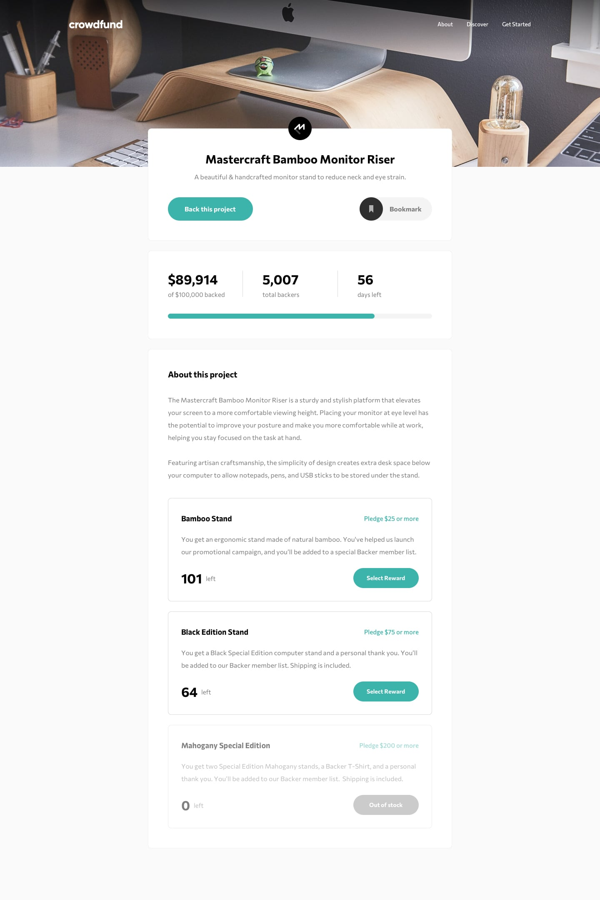

## Frontend Mentor - Crowdfunding Product Page Solution

This is a solution to the [Crowdfunding product page challenge on Frontend Mentor](https://www.frontendmentor.io/challenges/crowdfunding-product-page-7uvcZe7ZR).
Frontend Mentor challenges help you improve your coding skills by building realistic projects.

<p>
  <a href="https://www.frontendmentor.io/solutions/responsive-crowdfunding-product-page-w-html---css---js-YAZO6t5gId">
    </a>
  <a href="https://haquanq-frontendmentor.github.io/crowdfunding-product-page/">
    </a>
  <a href="./LICENSE"
    ></a>
</p>

## Table of Contents

- [Project Overview](#sunrise-project-overview)
- [Tech Stack and Approach](#stars-tech-stack-and-approach)
- [Local Development](#leaves-local-development)
- [Deployment](#maple_leaf-deployment)

## :sunrise: Project Overview

### Challenge Requirements

- View the optimal layout depending on their device's screen size
- See hover states for interactive elements
- Make a selection of which pledge to make
- See an updated progress bar and total money raised based on their pledge total after confirming a pledge
- See the number of total backers increment by one after confirming a pledge
- Toggle whether or not the product is bookmarked (**not possible**)

### Status

Features

- [x] Multi-options form with expand/collapse input field (animated)
- [x] Modal with keyboard navigation

Accessibility

- [x] Responsive accross different screen sizes
- [x] Interactive elements have clear focus indicator

### Preview (Desktop)



## :stars: Tech Stack and Approach

### Built With

- **HTML5** – Semantic structure
- **CSS Grid & Flexbox** – Layout
- **PostCSS** – Nested rules, custom media queries, future CSS features, minification
- **Stylelint** – CSS linting, code style consistency
- **TypeScript** - Interactivity and application logic
- **Vite** - Fast development server, production build and easy configuration

### Approach

- Mobile-first workflow for better performance on smaller devices
- Accessibility guided by [ARIA Authoring Practices Guide (APG)](https://www.w3.org/WAI/ARIA/apg/)

## :leaves: Local Development

### Prerequisites

Install the following:

- Git (latest version)
- Node.js (latest LTS recommended)
- pnpm (latest version)

### Setup

```
git clone https://github.com/haquanq-frontendmentor/crowdfunding-product-page.git
cd crowdfunding-product-page
pnpm install
```

### Start Development Server

```
pnpm dev
```

## :maple_leaf: Deployment

Deployed to Github Pages via Github Actions (manually triggered).
